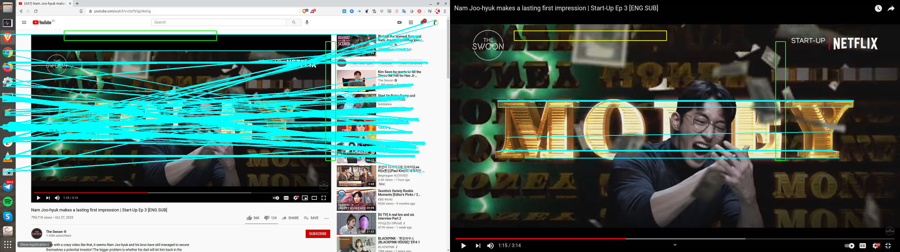

# window-det

## Introduction

This repo attempts to detect lines/windows/gui elements within a given input image (can be a screenshot etc.).

Simple aggregation of traditional CV (as opposed to deep learned) approaches in our pipeline:

1. Input image goes through [**Canny Edge Detector**](https://opencv-python-tutroals.readthedocs.io/en/latest/py_tutorials/py_imgproc/py_canny/py_canny.html) &rarr; Binary map of edges
2. [**Closing**](https://opencv-python-tutroals.readthedocs.io/en/latest/py_tutorials/py_imgproc/py_morphological_ops/py_morphological_ops.html) is applied on the binary map to clean up small gaps between potential line edges
3. [**Hough Transform**](https://opencv-python-tutroals.readthedocs.io/en/latest/py_tutorials/py_imgproc/py_houghlines/py_houghlines.html) is then applied on the resultant binary map of edges to detect lines &rarr; a set of lines according to criteria set
4. This set of legit lines is tested for interception with given target rectangles. If all given target rectangles have lines intersecting them, then it is considered a positive case and the window is determined to exist in given image.

Since traditional CV approaches are used, you should probably expect that you will need to tune your parameters to your data to achieve your desired results. This repo is meant for a fixed setting, suitable for consistent screenshots within a fixed set of window configurations.

### Example Use Case

In an example, we use this repo to find out if a given screenshot from a fixed screen has a maximised or minimised youtube video player. We set target rectangles where we will expect the minimised youtube video player's window to be.

Example input images: 

- Positive example of video player minimised
  
- Negative example of video player maximised
  

## Requirements

- Python3
- OpenCV (cv2)
- numpy
- pprint

## Parameters

Parameters to the algorithms can be defined in json config files and given to `WindowDetector` objects. See `configs/default.json` and `configs/test.json`.

For selection of parameters, you can execute [tuning](#tune).

## Tune

Before tuning:


After tuning:


 Cyan lines: Detected lines intersecting a target rectangle  
 Green rectangle: Target rectangle which has lines intersecting it  
 Yellow rectangle: Target rectangle with no lines intersecting it

```python
python3 tune.py --config configs/yt-example.json --pos example_inputs/positive-minimised.jpg --neg example_inputs/negative-maximised.jpg  --out configs/tuning.json
```

Running this will spin up a cv2 window with trackbars that control different parameters for the Hough transform, where you can tune and see the results in real-time. After exiting from cv2 window (press `q`), most recent trackbar values will be printed out and saved out to `configs/tuning.json` by default.

To tune the other parameters, just modify the trackbar code segments according for your parameters you want to tune. 

## Run

```python
python3 run.py --config configs/yt-tuned.json --output example_outputs/results.txt --dir example_inputs
```

Results will be outputted to given output path as txt file, in `<image path>,<whether target window exists>` lines.
